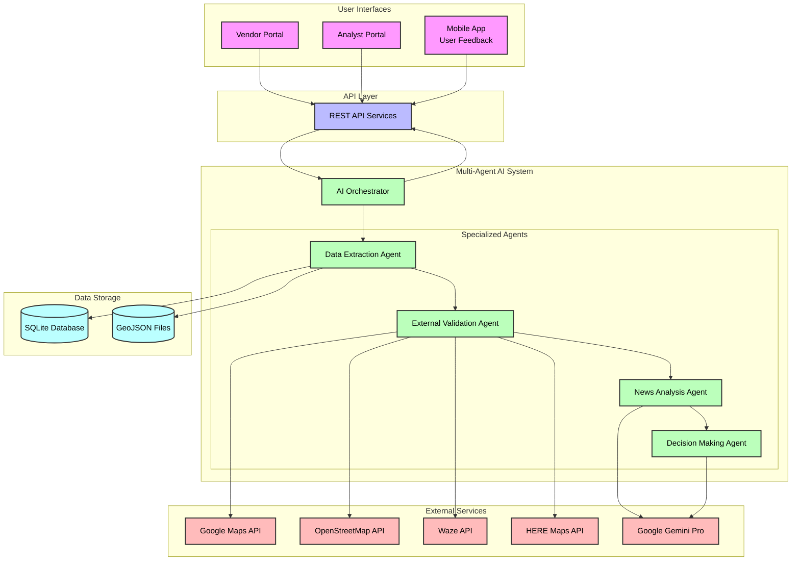
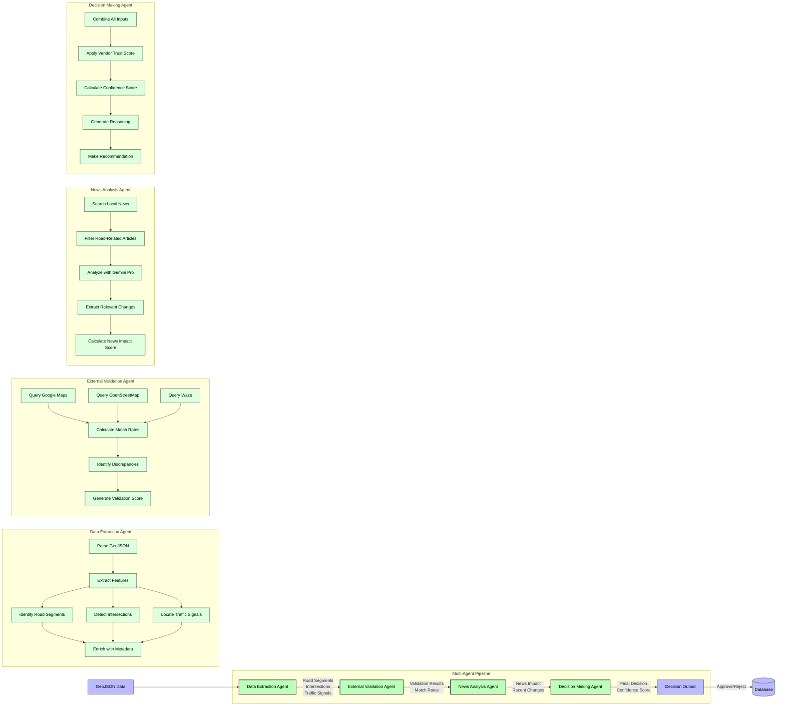
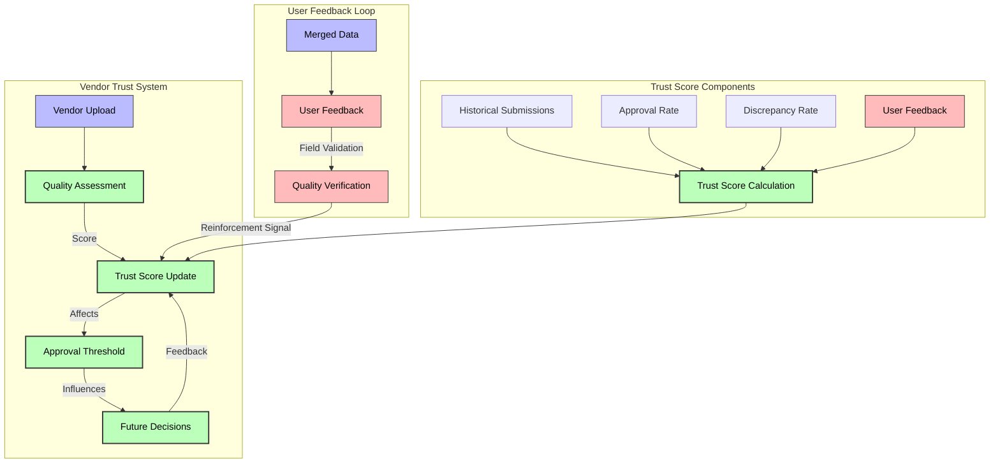
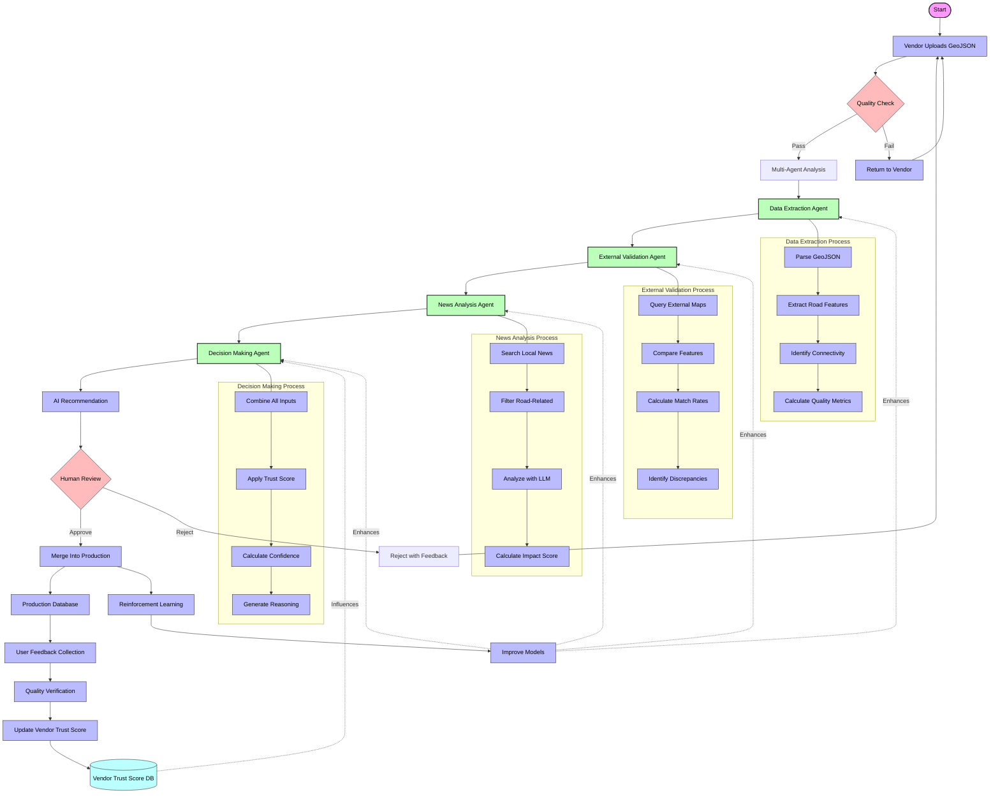

# RoadFusion: AI-Powered Smart Road Data Merger

<div align="center">
  
  <p><em>Transforming Road Data Management with Multi-Agent AI</em></p>
</div>

## 🌟 Overview

RoadFusion is a cutting-edge platform that revolutionizes how road infrastructure data is validated, analyzed, and merged into production systems. Using a sophisticated multi-agent AI architecture, RoadFusion ensures that only high-quality, validated road data makes it into mapping systems, improving navigation accuracy and safety for millions of users worldwide.

## 📸 Screenshots

### Analyst Dashboard - Multi-Agent Analysis
<div align="center">
  
  <p><em>Analyst dashboard showing the multi-agent analysis pipeline in action</em></p>
</div>

### Map Visualization Interface
<div align="center">
  
  <p><em>Interactive map visualization of road data with quality indicators</em></p>
</div>

### Vendor Trust Score Dashboard
<div align="center">
  
  <p><em>Vendor trust score dashboard showing historical performance metrics</em></p>
</div>

### Decision Analysis Interface
<div align="center">
  
  <p><em>Detailed decision analysis with confidence scores and reasoning</em></p>
</div>

### Mobile Companion App
<div align="center">
  
  <p><em>Mobile companion app for field validation and user feedback collection</em></p>
</div>


## 🚀 Unique Selling Points

### 1. Multi-Agent AI Architecture

RoadFusion employs a sophisticated multi-agent system where specialized AI agents work collaboratively to analyze road data:

- **Data Extraction Agent**: Processes raw GeoJSON data to identify road segments, intersections, and traffic signals
- **External Validation Agent**: Cross-references data with trusted sources like Google Maps, Waze, and OpenStreetMap
- **News Analysis Agent**: Scans recent news for road construction, closures, or changes that might affect data accuracy
- **Decision Agent**: Combines all inputs to make the final merge recommendation with confidence scoring

### 2. Reinforcement Learning Trust System

Our platform features a unique vendor trust scoring system that evolves over time:

- Vendor trust scores are dynamically updated based on data quality history
- Each successful merge increases vendor reliability ratings
- Poor quality submissions decrease trust scores
- System automatically adjusts approval thresholds based on historical performance

### 3. User Feedback Integration

RoadFusion incorporates real-world feedback to continuously improve:

- Companion mobile app allows users to submit field observations
- Feedback is used to validate vendor data submissions
- Reinforcement learning mechanisms incorporate user reports into trust calculations
- Creates a virtuous cycle of data improvement

### 4. Transparent Decision Making

Unlike black-box systems, RoadFusion provides clear reasoning for all decisions:

- Detailed confidence scores with component breakdowns
- Visual comparison of submitted data vs. existing map data
- Comprehensive reasoning for approval/rejection decisions
- Full audit trail of all data validations

## 🛠️ Technology Stack

### Backend

- **Python**: Core application logic and API endpoints
- **Flask**: Web framework for RESTful API
- **SQLite**: Database for storing GeoJSON files and analysis results
- **Google Gemini Pro**: Advanced LLM for complex reasoning and decision-making

### Frontend

- **React**: UI framework with TypeScript
- **Tailwind CSS**: Utility-first CSS framework
- **Shadcn/UI**: Component library
- **Vite**: Build tool and development server

### Data Processing

- **GeoJSON**: Standard format for geospatial data
- **HERE Maps API**: Geospatial data validation and enrichment
- **OpenStreetMap**: Reference data for validation

### External APIs

<div style="display: flex; justify-content: space-between; margin: 20px 0;">
  
  
  
  
  
</div>

## 🏗️ System Architecture

### High-Level Architecture



### Multi-Agent System Detail



### Reinforcement Learning Trust System



## 📊 Data Flow



### Data Flow Description

1. **Data Submission**: Vendors upload GeoJSON files through the vendor portal
2. **Initial Quality Check**: Basic validation of GeoJSON format and structure
3. **Multi-Agent Analysis**:
   - **Data Extraction Agent**: Processes the raw GeoJSON to identify road segments, intersections, and traffic signals
   - **External Validation Agent**: Cross-references with trusted sources like Google Maps, Waze, and OpenStreetMap
   - **News Analysis Agent**: Checks for relevant road updates, construction, or closures in the area
   - **Decision Agent**: Combines all inputs to make a recommendation with confidence scoring
4. **Analyst Review**: Human analysts review AI recommendations and make final decisions
5. **Production Integration**: Approved data is merged into production systems
6. **Feedback Loop**: User feedback from the companion app validates merged data and updates vendor trust scores
7. **Continuous Learning**: The system uses reinforcement learning to improve agent performance over time

## 🚗 Use Cases

- **Map Data Providers**: Validate and merge road network updates from multiple sources
- **Transportation Departments**: Maintain accurate road infrastructure databases
- **Navigation Companies**: Ensure high-quality road data for routing algorithms
- **Urban Planners**: Analyze road network changes and plan infrastructure improvements
- **Emergency Services**: Access the most up-to-date road information for critical response

## 🛠️ Setup and Installation

### Prerequisites

- Python 3.9+
- Node.js 16+
- pnpm or npm
- SQLite

### Backend Setup

```bash
# Clone the repository
git clone https://github.com/yourusername/roadfusion.git
cd roadfusion

# Set up Python virtual environment
python -m venv venv
source venv/bin/activate  # On Windows: venv\Scripts\activate

# Install dependencies
cd backend
pip install -r requirements.txt

# Initialize the database
python create_db.py

# Start the backend server
python app.py
```

### Frontend Setup

```bash
# Navigate to the frontend directory
cd frontend

# Install dependencies
pnpm install  # or npm install

# Start the development server
pnpm run dev  # or npm run dev
```

## 🔧 Configuration

Create a `.env` file in the backend directory with the following variables:

```
FLASK_APP=app.py
FLASK_ENV=development
DATABASE_PATH=database.db
GEMINI_API_KEY=your_gemini_api_key
GOOGLE_MAPS_API_KEY=your_google_maps_api_key
HERE_API_KEY=your_here_api_key
```

## 📱 Mobile Companion App

The RoadFusion ecosystem includes a mobile companion app that allows users to submit real-time feedback about road conditions, construction, and map accuracy. This feedback is incorporated into the AI analysis pipeline to improve data quality and validation.

Key features of the mobile app include:

- Real-time road condition reporting
- Photo submission of road issues
- GPS-tagged feedback for precise location mapping
- Integration with the vendor trust scoring system
- Gamification elements to encourage user participation

User feedback serves as a critical reinforcement learning signal that continuously improves the quality of our road data and vendor trust assessments.

## 🤝 Contributing

We welcome contributions to RoadFusion! Please see our [Contributing Guidelines](CONTRIBUTING.md) for more information.

## 📄 License

This project is licensed under the MIT License - see the [LICENSE](LICENSE) file for details.

## 🙏 Acknowledgements

- HERE Technologies for providing mapping APIs and hosting the hackathon
- Google for Gemini Pro API access
- OpenStreetMap community for open geospatial data
- All contributors and testers who helped improve RoadFusion
